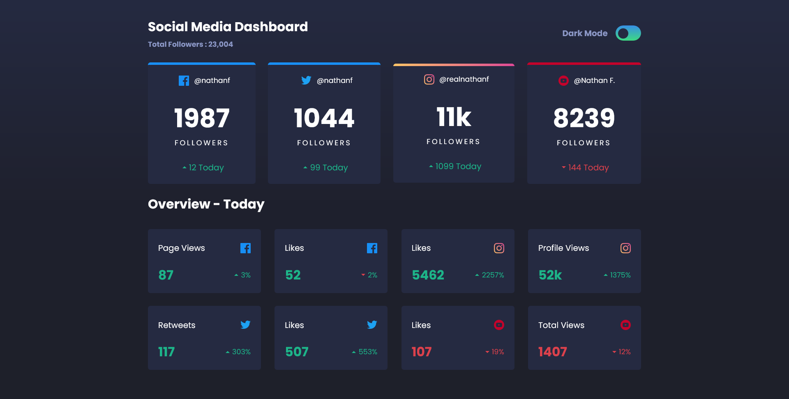

# Frontend Mentor - Social media dashboard with theme switcher solution

This is a solution to the [Social media dashboard with theme switcher challenge on Frontend Mentor](https://www.frontendmentor.io/challenges/social-media-dashboard-with-theme-switcher-6oY8ozp_H). Frontend Mentor challenges help you improve your coding skills by building realistic projects. 

## Table of contents

- [Overview](#overview)
  - [The challenge](#the-challenge)
  - [Screenshot](#screenshot)
  - [Links](#links)
- [My process](#my-process)
  - [Built with](#built-with)
  - [What I learned](#what-i-learned)
  - [Continued development](#continued-development)
- [Author](#author)
- [Acknowledgments](#acknowledgments)

**Note: Delete this note and update the table of contents based on what sections you keep.**

## Overview

### The challenge

Users should be able to:

- View the optimal layout for the site depending on their device's screen size
- See hover states for all interactive elements on the page
- Toggle color theme to their preference

### Screenshot



### Links

- Solution URL: [https://github.com/Haybuka/dashboard-with-theme.git](github)
- Live Site URL: [https://dashtheem.netlify.app/](netlify)

## My process

### Built with

- Semantic HTML5 markup
- CSS custom properties
- Flexbox
- Context Api
- Desktop-first workflow
- [React](https://reactjs.org/) - JS library


### What I learned

During the course of this project, i learnt how to pass data through context hooks and also to consume such data with ease. Also, i got to understand how the structure and interconnection of layout with the context providers and their respective hooks.


```js
export const ThemeContext = createContext();

export function ThemeProvider (children) {
    const [state,setState] = useState(false)
    <ThemeContext.Provider value={state}>
      {children}
    </ThemeContext.Provider>
}

```

### Continued development

I do Hope to continue learning on context, memo and also connecting them all with reducers for better state management.


## Author

- Website - [Ndulue Paschal](https://chukwu.netlify.app)
- Frontend Mentor - [@Haybuka](https://www.frontendmentor.io/profile/Haybuka)
- Twitter - [@haybukarh](https://twitter.com/haybukarh)
